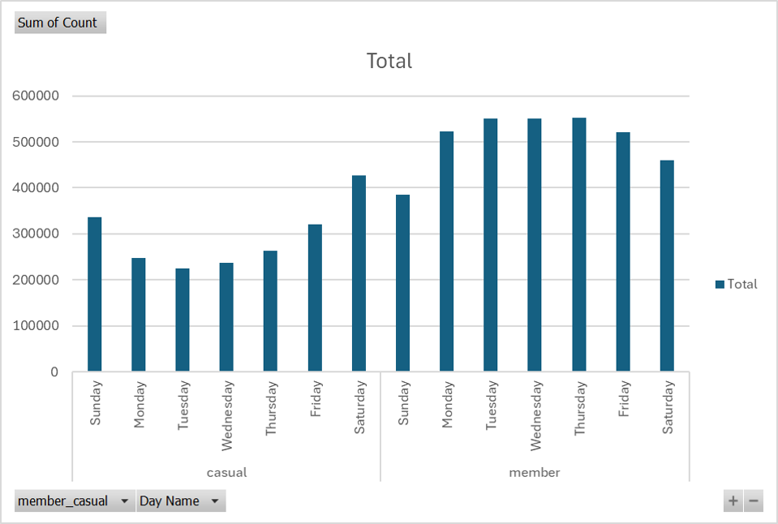

# Cyclistic-Project

## Project Background

Cyclistic is a bike-share company in Chicago. The director of marketing believes the company’s future success depends on maximizing the number of annual memberships. Therefore, the marketing analytics team wants to understand how casual riders and annual members use Cyclistic bikes differently, in order to design a new marketing strategy to convert casual riders into annual members. 

We want to identify how casual and annual riders differ, what would encourage casual riders to switch to an annual membership, and how digital media could help the marketing strategy. These insights will determine how we will design the marketing strategy to encourage casual riders to switch to an annual membership, and therefore boost our profit margin and hence the revenue.

## Data Structure Overview

Due to time limits I did not check on the quality of data – I should revisit this when redoing the project

## Executive Summary 

### Main findings: 
1. Casual riders ride for leisure on weekends and for commute on weekday evenings (rush hour), whereas member riders ride mainly for commute on weekday mornings and evenings, although they also ride for leisure on weekends.
2. Casual riders typically ride longer per ride, which may signal they do so for leisure, and also to make use of the price they paid per ride. Members on the other hand typically ride for very short periods (mostly less than 10 minutes), possibly for commuting.

### Recommendations:
1. New packages tailored to leisure riders
- The fact that they do not currently go for the annual membership signal that the annual package is more expensive than pay-per-ride for them. But this may discourage them from riding more. 
- A win-win can be achieved if we find the right package that encourages casual riders to ride more and therefore spend more overall, but pay less per ride. 
- A right package could be one where members of this package type can have a specific number of rides per month for a specific price that is lower than the pay-per-ride fare. The specific number of rides per month would then have to be higher than the typical number of rides for casual riders.

2. Use digital media to further enhance marketing
- How digital media could help the marketing strategy: Further marketing the rides (to current and new casual riders) as a leisure activity you can do with friends/family regularly,  so that leisure riders would be encouraged to purchase annual memberships.

## Insights Deep Dive

Casual riders ride for leisure on weekends and for commute on weekday evenings (rush hour), whereas member riders ride mainly for commute on weekday mornings and evenings, although they also ride for leisure on weekends.

No. of rides by Day of Week (Casual vs. Member)

As you can see above ,
Casual riders tend to ride on weekends rather than weekdays => Leisure ride rather than for commute
Members tend to ride on weekdays more => Rides are more of a necessity for commute to/from work

No. of rides by Hour when the journey started (Casual vs. Member)

For casual riders, only spike during evening time (could be commuting during rush hour on weekdays or weekends).
For members, two spikes during morning and evening rush hours.
Not sure how this differs between weekdays and weekends, so we further dissect the data as seen below:

No. of rides on Weekdays by Hour when the journey started (Casual vs. Member)

Filtering for only weekdays (Mon to Fri inclusive), we see that the trend is similar to the general trend, where casual riders have one spike in rides (4 to 6pm), whereas member riders have two spikes (7 to 9am).
We can conclude that for casual riders, they may commute from work back home, but often do not commute to work (Could be too tired to ride a bike in the morning), whereas members ride to and from work (Could be because they already paid for an annual membership, and therefore they want to make use of their membership.)

Casual riders typically ride longer per ride, which may signal they do so for leisure, and also to make use of the price they paid per ride. Members on the other hand typically ride for very short periods (mostly less than 10 minutes), possibly for commuting.

No. of rides by duration (Casual riders vs. Members)

We can infer here that a larger proportion of casual riders ride long rides (more than 30 minutes) than members (more casual riders riding in the "30 to 60" and "Over 60" buckets than members, despite fewer casual riders overall).
This could be because member riders do not need to pay per ride, and thus they can take shorter rides without incurring costs for just a short few minutes ride.
This could also signal again that casual riders ride for leisure rather than out of necessity for commuting, thus they ride longer.

## Recommendations

What would encourage casual riders to switch to an annual membership:
They will only switch membership if they find the overall cost to be cheaper.
We want them to switch membership so that we earn more revenue.
The fact that they do not currently go for the annual membership signal that the annual package is more expensive than pay-per-ride for them. But this may discourage them from riding more. A win-win can be achieved if we find a right package that encourages casual riders to ride more and therefore spend more overall, but pay less per ride.
A right package could be one where members of this package type can have a specific number of rides per month for a specific price that is lower than the pay-per-ride fare. The specific number of rides per month would then have to be higher than the typical number of rides for casual riders.

How digital media could help the marketing strategy
Further marketing the rides (to current and new casual riders) as a leisure activity you can do with friends/family regularly,  so that leisure riders would be encouraged to purchase annual memberships.

Future analysis
Geospatial analysis and comparison between casual vs member riders can inform our marketing strategy too (Time limitation for this case study) and the pricing of annual packages (more popular routes can cost more).
Would be useful to have additional information of how much each rider pays per ride, or per month (Casual vs annual). This can help better inform pricing decisions.

## Methodology (for interviews or for anyone curious how I did it step-by-step)

Crafted business question based on case study guide (link to pdf)
Downloaded the dataset here: link to dataset
Used Power Query to import data and combine last 12 months of data
While in Power Query editor, I familiarised myself with the data, identified what kind of trends / insights I can generate from the data points we have. 
After loading the data from Power Query, I created a Pivot table and conducted exploratory data analysis by creating visualizations. I pasted the charts/graphs into the EDA Sheet, wrote bullet points on what I can observe from the visualization. I highlighted in green the insights that are meaningful to my analysis (i.e. I can observe a trend or clear difference).
I then created another sheet to answer the business question with my EDA (My Recommendations).
